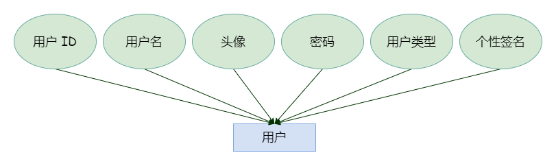
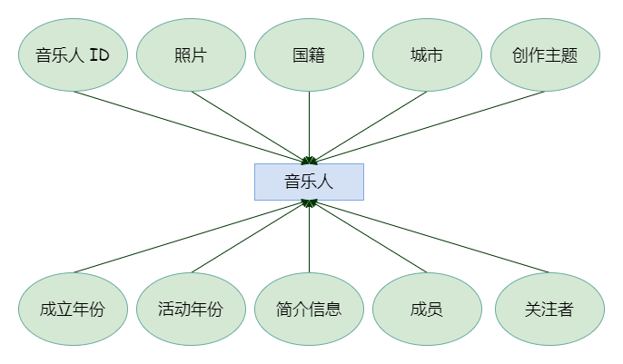
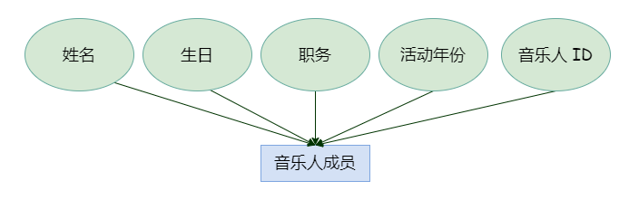
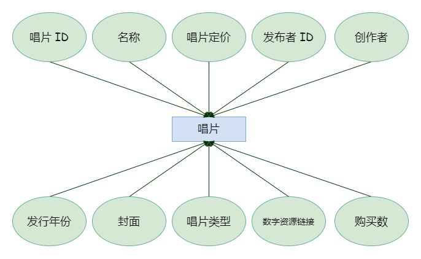
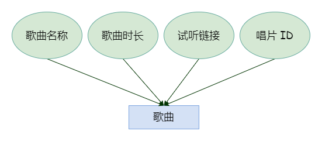
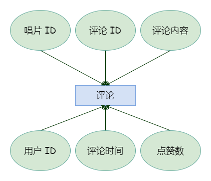
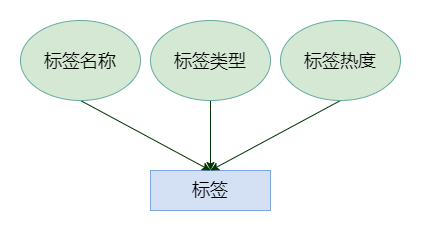
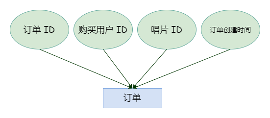
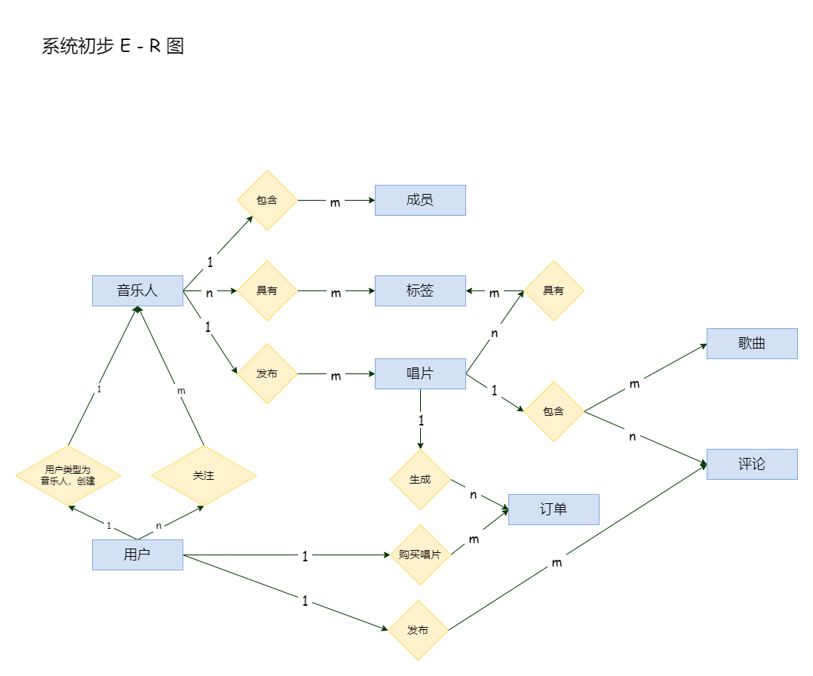
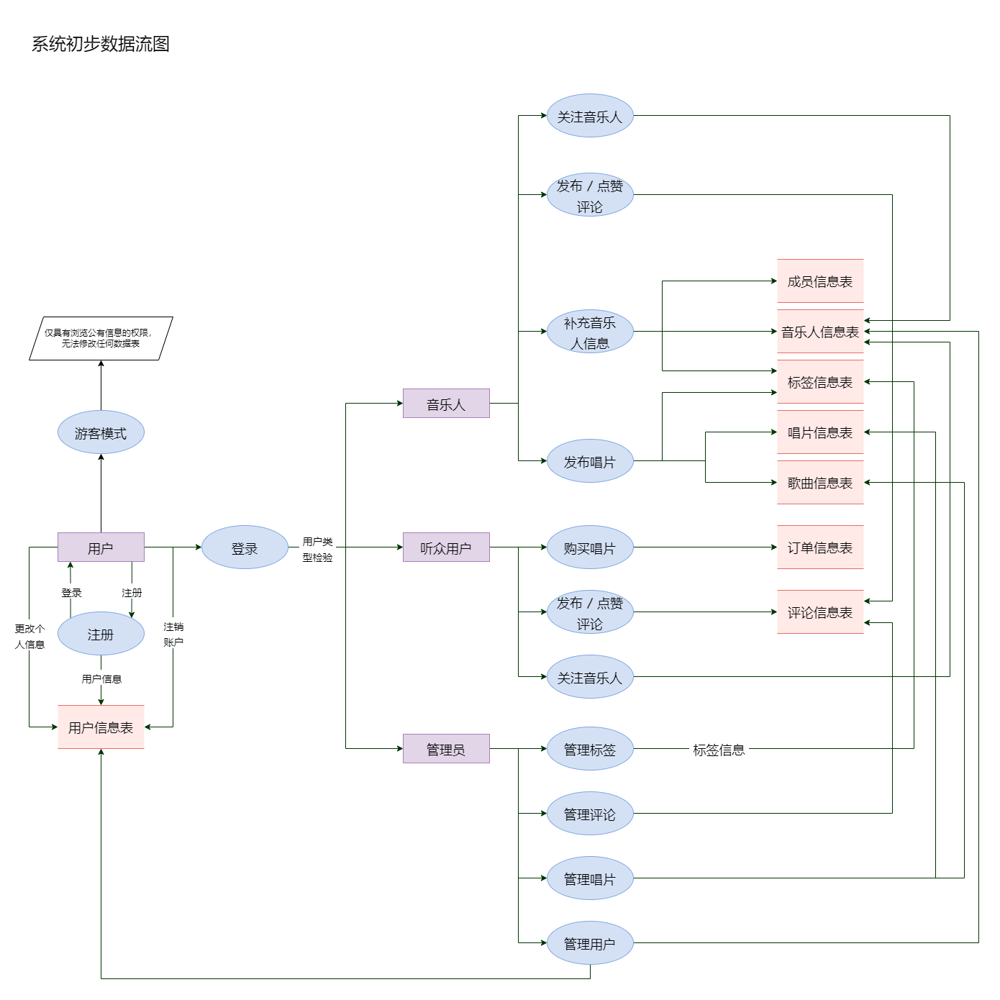

[TOC]

# 题目名称

- **名称**：“群岛 · Archipelago”数字唱片销售平台
- **平台 icon**：如下图所示

# 小组成员信息

| 姓名   | 学号     | 分工                                     | 备注         |
| ------ | -------- | ---------------------------------------- | ------------ |
| 蔡赋忞 | 20372023 | 系统客户端开发                           | 全组参与讨论 |
| 王哲   | 20373209 | 系统服务器端开发                         | 全组参与讨论 |
| 郭晓燕 | 20373543 | 系统功能设计与数据库设计；系统客户端开发 | 全组参与讨论 |

# 作业内容说明

## 需求简述

“群岛 · Archipelago”是一款专注于小众独立音乐人的数字唱片销售平台，同时也能作为音乐爱好者发掘、联系并直接支持小众艺术家们的音乐交流社区，其原型是独立音乐人数字音源销售平台 *bandcamp* 和运营了长达 20 年的金属乐队维基 *The Metal Archives*。

“群岛”平台支持四种模式，分别是游客模式、听众登录模式、音乐人模式和管理员模式，包括歌曲、唱片、用户、音乐人、成员、评论、订单、标签等实体。构建关系表时我们仿照了 bandcamp 的处理模式，并根据本平台的几类使用人群分析初始需求如下：

- **音乐人用户：“群岛”中音乐资源的发布者**
    - 音乐人用户具有发布数字唱片的权限，可以发布并修改具有详细内容属性信息的数字唱片资源；
    - 音乐人用户可以撤下自己发布的数字唱片；
    - 音乐人用户具有对唱片的评论权限，也可以删除自己的评论。每条评论需要被展示在唱片页面的评论区中；
    - 音乐人用户可以编辑并在主页显示音乐人属性信息，构建一个自己的“音乐维基”，帮助音乐爱好者更好地了解自己，同时也助力完善了本平台专业的音乐分类机制；
        - 也即，音乐人用户可以创建并编辑音乐人实体信息
        - 音乐人用户具有新增标签库的权限，可以为自己的音乐人属性以及发布的数字唱片增加流派标签；
    - 音乐人用户具有修改基础个人信息的权限，比如昵称、密码等；
    - 音乐人用户不具有购买的权限；
- **听众用户：“群岛”客户端的主要使用者**
    - 听众用户具有修改基础个人信息的权限，比如昵称、密码等；
    - 听众用户具有对唱片的评论权限，也可以删除自己的评论。每条评论需要被展示在唱片页面的评论区中；
    - 听众用户具有购买权限，可以付费下载自己心仪的数字唱片资源，生成订单信息；
    - 听众用户具有搜索权限，能够根据本平台详细专业的音乐分类标签检索自己喜欢的音乐流派 / 音乐人等；
        - 游客模式只具有搜索权限，对唱片、音乐人、评论信息的查询权限，无法进行评论、购买。
- **管理员：“群岛”平台的管理者**
    - 管理员具有对所有评论实体、标签实体、唱片实体和用户实体的修改和删除权限，主要起到审核的作用。

---

在音乐市场几乎被唱片资本公司与大型厂牌垄断的当下，未经签约的独立音乐一直小众而式微，我们衷心希望能有这样一片纯净的群岛，供优秀的独立音乐人们和音乐爱好者们共同发现、共同探索，传递音乐艺术的美好，让创作的空间不再有那样多的遗珠之恨。

## 数据库关系模式初步设计

### 系统初步 E-R 图

#### 分实体

该数据库系统具有**用户、音乐人、音乐人成员、唱片、歌曲、评论、标签**和**订单** 8 个实体，分实体得到如下 E - R 图。

##### 用户 E - R

##### 音乐人 E - R

##### 音乐人成员 E - R

##### 唱片 E - R

##### 歌曲 E - R

##### 评论 E - R

##### 标签 E - R

##### 订单 E - R

#### 实体联系图

根据上述的分实体 E - R 加入实体间的联系关系后，给出系统初步 E - R 图（省略实体属性）：

### 数据流图初步设计

### 数据元素表

题目申报文件中仅说明以下几个可能需要解释的值约束：

- **用户类型 in “用户”**
    - 听众
    - 管理员
    - 音乐人

- **唱片类型 in “唱片”**
    - EP（单曲唱片）
    - Single（单曲）
    - Album（录音室专辑）
    - Live（现场专辑）
    - Demo（小样）
    - Split（拼盘）
    - Compilations（精选辑）
    - Various Artists（合辑）
    - Original Soundtrack（原声带）
- **标签类型 in “标签”**
    - 风格流派
    - 音乐情绪
    - 器乐元素